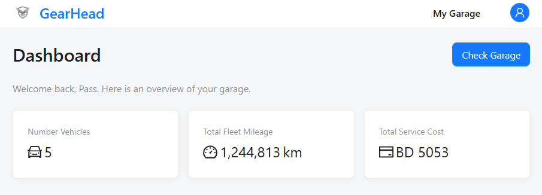
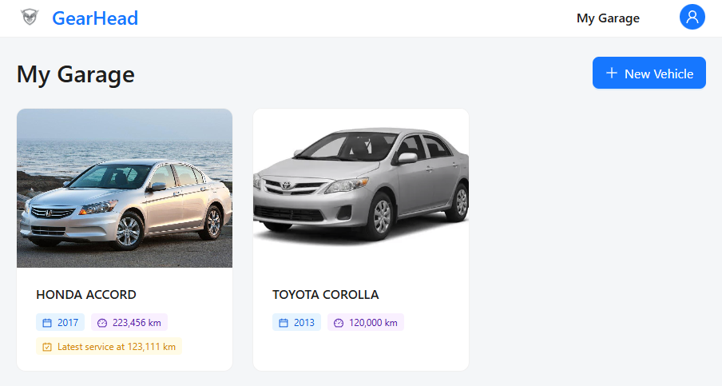
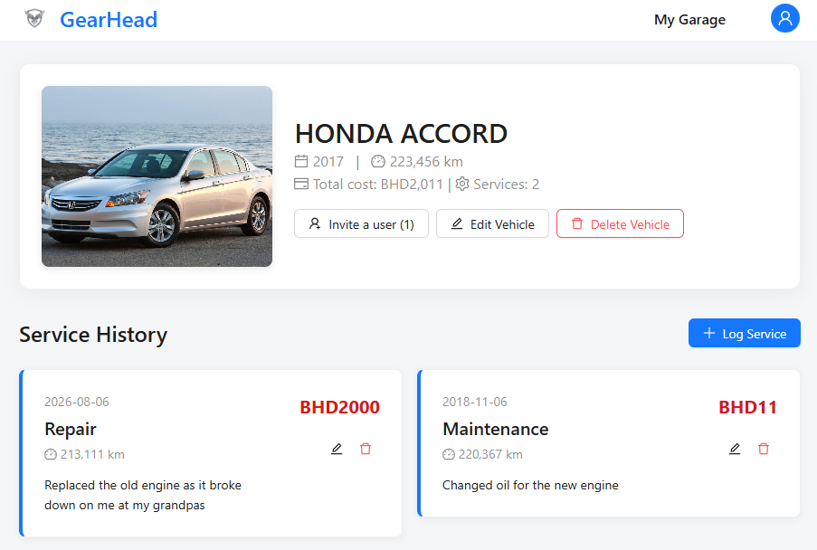

# GearHead - Personal Garage Management

A robust, full-stack vehicle management platform built with the MERN stack (MongoDB, Express, React, Node.js). This platform allows users to digitally track their vehicles, log specific maintenance records, monitor total service costs, and securely collaborate with other users by sharing garage access.





### Live Demo
[Deployed Website](hhttps://gearhead1.netlify.app/)

[Planning Material](https://trello.com/b/NnsA8Oei/gearhead-track-you-own-vehicles-history)

## Features

* **User Authentication & Authorization**: Secure sign-up and sign-in workflows utilizing JSON Web Tokens (JWT) and password hashing.
* **Garage Management**: Users can effortlessly add, edit, and delete vehicles from their personal garage, complete with custom image uploads.
* **Service Tracking**: Log detailed service records (maintenance, repairs, detailing) with associated costs and mileage. The dashboard automatically calculates the total investment per vehicle.
* **Collaboration & Sharing**: Securely invite other registered users to view a vehicle's service history. Owners can manage access via a dedicated dashboard toggle to revoke permissions instantly.
* **Modern UI/UX**: Built with a clean, responsive interface utilizing Ant Design for consistent, accessible, and intuitive components (like modals, popconfirms, and interactive lists).

## Tech Stack

* **Frontend**: React.js (Vite), React Router, Ant Design
* **Backend**: Node.js, Express.js
* **Database**: MongoDB, Mongoose
* **Image Hosting**: Cloudinary, Multer
* **Authentication**: JSON Web Tokens (JWT), bcrypt

## Prerequisites

Before running this project locally, ensure you have the following installed:
* Node.js (v18 or higher)
* MongoDB (running locally or a MongoDB Atlas URI)
* A Cloudinary account for handling image uploads

## Installation and Setup

This project uses a decoupled architecture with separate frontend and backend directories.

**1. Clone the repository**
```bash
git clone [https://github.com/YourUsername/GearHead.git](https://github.com/YourUsername/GearHead.git)
cd GearHead
```

**2. Backend Setup**
```bash
# Navigate to the backend directory
cd gearhead-backend

# Install dependencies
npm install
```

 Create a .env file in the gearhead-backend directory
```
PORT=3000
MONGODB_URI=your_mongodb_connection_string
JWT_SECRET=your_jwt_secret_key
CLOUDINARY_CLOUD_NAME=your_cloud_name
CLOUDINARY_API_KEY=your_api_key
CLOUDINARY_API_SECRET=your_api_secret
```

 Start the backend server (development mode)
```bash
npm run dev
```

**3.Frontend Setup**

Open a new terminal window
```bash
# Navigate to the frontend directory
cd gearhead-frontend

# Install dependencies
npm install
```

Create a .env file in the gearhead-frontend directory
```
VITE_BACK_END_SERVER_URL=http://localhost:3000
```

Start the React development server
```bash
npm run dev
```

**4. Access the app**

Open your browser and navigate to `http://localhost:5173`.

## Application Structure

### Backend (`gearhead-backend/`)
* **`models/`**: Mongoose schemas for `User` and `Vehicle` (which includes embedded `ServiceRecord` subdocuments).
* **`controllers/`**: API route handlers for authentication, vehicle CRUD, and sharing logic.

### Frontend (`gearhead-frontend/`)
* **`src/components/`**: Reusable UI elements like the Navigation bar.
* **`src/pages/`**: Primary page views (Dashboard, Vehicle Details, Authentication forms).
* **`src/services/`**: Fetch API modules to communicate securely with the backend.

---

## Assets Used

### Image Hosting & Media Management:
* **Cloudinary**: Used for cloud storage and optimization of user-uploaded vehicle images, utilizing Multer to parse `multipart/form-data` requests.
* **Default Assets**: Standardized fallback imagery (`carErrorImage.png`) to maintain layout consistency for vehicles lacking a custom photo.
* **Custom Branding**: Minimalist vector logo (text-free visual emblem).

### UI/UX Components & Styling:
* **Ant Design (antd)**: A comprehensive enterprise-class UI design language and React component library used to accelerate development and provide highly polished forms, layout grids, cards, and interactive modal dialogs.
* **React Router**: Implemented for seamless, client-side navigation and protected route handling.

---

## Future Enhancements

* Enable PDF exporting for a vehicle's complete service history.
* Analytics dashboard to visualize maintenance spending over time via charts.
* Integration with public APIs to automatically pull vehicle specs by VIN or Make/Model.
* Mobile application build using React Native.

---

## Credits

This project would've not been possible without the help and support of my instructor in GA, Ms. Nabila and the Instructor Associates, Ms. Zainab and Ms. Bidoor.